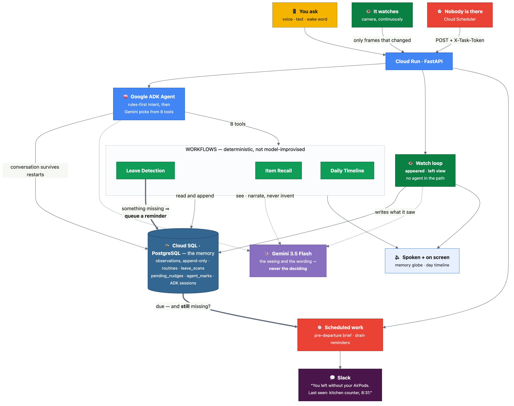
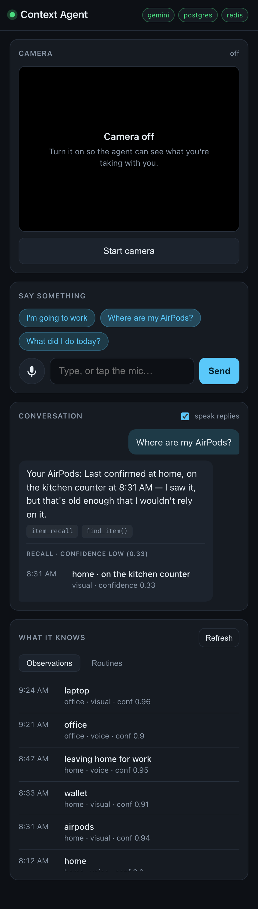

# Personal Context Agent

An autonomous agent that watches your context and acts on it without being asked.

People with ADHD don't forget that they own things. They forget what *happened*
to them. This agent holds that thread: it notices what you have, remembers where
it was, and tells you before it becomes a problem.

```
You:   I'm going to work
Agent: You're missing your AirPods. You usually take them to work.
       Last seen on the kitchen counter at 8:42 AM.
```

---

## The three workflows

### 1. Leave detection — *catch it before you're out the door*

You say you're heading somewhere. The agent takes a camera frame, asks Gemini
what is actually in it, and compares that against the routine it has learned for
that destination. Anything missing comes back with a last-known location.

`agent/workflows.py::leave_detection`

### 2. Item recall — *where was it last seen?*

Searches the observation log for a thing and returns every sighting, newest
first, each with a confidence that **decays with age**. A sighting from ten
minutes ago is an answer; one from yesterday is a lead, and the agent says so
rather than sending you to the wrong room.

`agent/workflows.py::item_recall`

### 3. Daily timeline — *what did I actually do today?*

Reconstructs the day from the observation log and has Gemini narrate it. The
model is given the events and forbidden from inventing any; when the log is
thin, the agent says the log is thin.

`agent/workflows.py::daily_timeline`

---

## What makes it an agent, not a chat box

- **It acts unprompted, and the result reaches you.** Cloud Scheduler hits
  `/api/tasks/morning-brief` before your usual departure time and
  `/api/tasks/evening-recap` at night. Nobody asks it to — it runs, works out
  what it cannot vouch for, and posts to Slack:

  > ⚠️ **Before you leave for work**
  > Before you head to work: I can't currently vouch for your phone, wallet, keys, laptop, badge.

  Set `SLACK_WEBHOOK_URL` to enable it. Without it the jobs still run and still
  reach the right conclusion — they just tell nobody, which rather defeats the
  point. Delivery is best-effort: if Slack is down the job logs it, reports
  `"delivered": false`, and completes anyway.
- **It learns.** Carry something on most of your recent trips and it gets
  promoted into that destination's routine automatically
  (`_refine_routine`). The second week is better than the first.
- **It decides what to do.** Google ADK gives Gemini eight tools and the agent
  picks. There is no `if intent == "recall"` switch on the conversational path.
- **Its memory is a log, not a model's recollection.** Every decision — what's
  missing, when something was last seen — is computed from an append-only
  Postgres table. Gemini phrases the answer; it does not source the facts.

---

## Conversation memory

Sessions are stored in Postgres through ADK's `DatabaseSessionService`, so a
conversation survives a restart and survives being routed to a different
instance. ADK's default `InMemorySessionService` keeps the whole conversation in
one process's RAM: a restart erases it, and on more than one instance turn two
can land somewhere that has never heard of turn one.

```bash
uv run python scripts/verify_session_durability.py
# session backend: postgres
# PASS: conversation history survives a fresh process.
```

Without `DATABASE_URL` it falls back to in-memory and says which backend it
settled on in the logs (`"sessions": "in-memory"`).

---

## Architecture

```
   Browser (Camera API + Web Speech API)
                 │  text + camera frame
                 ▼
   ┌───────────────────────────────┐
   │  FastAPI  (Cloud Run)         │
   │  ├─ /api/chat        human    │
   │  └─ /api/tasks/*     cron     │
   └───────────────┬───────────────┘
                   │
   ┌───────────────▼───────────────┐
   │  ADK Agent Runtime            │
   │  rules-first intent pass      │
   │  → Gemini picks a tool        │
   └───────────────┬───────────────┘
                   │
      ┌────────────┼────────────┐
      ▼            ▼            ▼
  context      memory       timeline      ← tools/ (what Gemini can call)
   tools        tools         tools
      └────────────┼────────────┘
                   ▼
   ┌───────────────────────────────┐
   │  Workflows (deterministic)    │  ← agent/workflows.py
   └───────────────┬───────────────┘
      ┌────────────┴────────────┐
      ▼                         ▼
  PostgreSQL                 Redis
  observations (append-only) sessions, camera frames,
  routines, leave_scans      last-seen index
```

The split that matters: **tools are the surface Gemini can reach; workflows are
where decisions get made.** A tool never decides what is missing — it calls a
workflow that computes it from the log. That is why the agent can't hallucinate
a sighting.



Full diagrams, including how it learns and how it degrades:
[`docs/architecture.md`](docs/architecture.md).

---

## Run it locally

**Requirements:** Python 3.14, Docker (for Postgres + Redis), and a Gemini API
key from [aistudio.google.com/apikey](https://aistudio.google.com/apikey).

### One command

```bash
./run.sh
```

That brings up Postgres and Redis, waits for them, applies the schema, seeds the
routines on first run, starts the server, and **opens <http://localhost:8080> in
your browser**.

On the very first run it creates `.env` for you with a generated
`POSTGRES_PASSWORD`, then stops and asks for your Gemini API key. Paste it into
`.env` as `GEMINI_API_KEY=...` and run `./run.sh` again.

Set `NO_OPEN=1` if you would rather it not launch a browser.

### Or step by step

```bash
uv sync                                    # dependencies
cp .env.example .env                       # configuration

# Fill in two values in .env:
#   GEMINI_API_KEY     — https://aistudio.google.com/apikey
#   POSTGRES_PASSWORD  — generate with: openssl rand -hex 24

docker compose up -d                       # Postgres + Redis
uv run python scripts/seed_demo.py --routines
PYTHONPATH=src uv run uvicorn main:app --reload --port 8080
```

Then open **<http://localhost:8080>**.

`POSTGRES_PASSWORD` has **no default anywhere** — `docker compose up` refuses to
start without it rather than falling back to a value that would end up committed.
It is defined once in the gitignored `.env`, and `DATABASE_URL` is interpolated
from it, so the credential lives in exactly one place.

### Check it's healthy

```bash
curl -s localhost:8080/health
# {"status":"ok","postgres":"up","redis":"up","gemini":"configured", ...}
```

Both `/health` and `/healthz` work. (`/healthz` is the Google convention — from
Borg, then Kubernetes — where the trailing `z` keeps a probe endpoint from
colliding with an app's own `/health` route. It is what the Dockerfile's
`HEALTHCHECK` uses. `/health` is there because that is what a person types.)

`status: degraded` means Postgres or Redis is unreachable. The service still
runs — it falls back to in-memory storage — but nothing survives a restart.

---

## Using the interface



Four sections, top to bottom:

**Camera.** Off until you press *Start camera*. Once live, any message that
sounds like leaving ("I'm off to work", "heading out") automatically grabs a
still and sends it with the turn — that frame is what the agent compares against
your routine. *Flip* switches between front and rear cameras on a phone.

**Say something.** Three tap-to-send chips for the three workflows, a text box,
and a microphone. The mic is push-to-talk: tap once to start, it stops on its own
when you finish speaking, and tapping again cancels. Typing always works, so a
browser without speech recognition is never a dead end.

Voice input is fussier than it looks, and three things are deliberate:

- **Tapping the mic cancels any reply being spoken.** Synthesis and recognition
  compete for the audio device: starting the mic while the page is talking ends
  recognition instantly, with no error. That is the exact shape of a real
  conversation — it answers, you reply — so it has to be handled.
- **Microphone permission is requested up front** with `getUserMedia`, rather
  than letting the recogniser fail vaguely later. You get the browser's own
  prompt and, if you decline, a specific reason.
- **Brief silence does not end the turn.** Chrome stops listening after about a
  second of quiet; we restart it while you still intend to speak, up to a 20
  second ceiling.

Anything that does go wrong appears **in the transcript**, not as small grey
text — a mic that silently does nothing is the worst possible feedback.

**Conversation.** The agent's reply, plus the machinery behind it: the recognised
intent, which tools it called (`find_item()`, `check_before_leaving()`), and the
structured result — found items in green, missing in red, and every sighting with
its confidence. *Speak replies* reads answers aloud; turn it off for a quiet room.

**What it knows.** The agent's live memory. *Observations* is the event log,
newest first, with how each fact was verified and how much it is currently
trusted. *Routines* is what it has learned you take where, and over how many
trips.

The screenshot above shows the honesty behaviour that matters most: the AirPods
were last seen at 8:31 AM, that sighting has decayed to **0.33**, and rather than
asserting a location the agent says it *wouldn't rely on it*.

### Trying it in 60 seconds

1. `./run.sh`, wait for the browser.
2. Type **"I left my keys on the hall table"** → it records the observation.
3. Type **"Where are my keys?"** → it answers from the log, with confidence.
4. Press *Start camera*, point it at your desk, say **"I'm going to work"** → it
   scans the frame and tells you what's missing from your work routine.
5. Type **"What did I do today?"** → it reconstructs the day.

Steps 2, 3 and 5 cost no camera access at all, so you can try the whole thing
before granting any permissions.

### A note on what gets stored

Camera frames themselves are held in Redis for 15 minutes and never written to
disk. What *is* stored permanently is what Gemini saw in them — item names,
locations and timestamps in the `observations` table.

That is the point of the app, but it means the log is a record of your
belongings and movements. It lives in your own Postgres. Treat any screenshot of
the *Observations* panel the way you would treat a photo of your desk, and note
that the Cloud Run deployment is `--allow-unauthenticated` by default — see the
security section of [DEPLOYMENT.md](DEPLOYMENT.md) before putting real data in it.

---

## Try the workflows without the UI

```bash
U=00000000-0000-0000-0000-000000000001

# Workflow 1 — needs a camera frame, so use the browser. Or scan with no frame:
curl -s -X POST localhost:8080/api/leave-scan \
  -H 'Content-Type: application/json' \
  -d '{"destination":"work","user_id":"'$U'"}' | jq .speech

# Workflow 2 — costs zero model calls
curl -s "localhost:8080/api/recall?item=AirPods&user_id=$U" | jq .speech

# Workflow 3
curl -s "localhost:8080/api/timeline?user_id=$U" | jq .speech
curl -s "localhost:8080/api/timeline?user_id=$U&question=what+was+I+doing+at+2pm" | jq .speech

# The autonomous jobs, triggered by hand
curl -s -X POST localhost:8080/api/tasks/morning-brief | jq .message
```

---

## Heads-up: free-tier quota

Measured on a free-tier key while building this, `gemini-3.5-flash` allows:

- **5 requests per minute**, and
- **20 requests per day.**

One conversational turn costs 2–3 requests (intent escalation, the agent's turn,
the follow-up after a tool returns), so the daily budget is roughly **seven
turns**. That is not enough to record a demo.

Options, in order of preference:

1. **Enable billing** on the project. The limits above are free-tier only.
2. **Use a model with a larger free allowance.** `gemini-2.5-flash` is fully
   multimodal and was still serving after `gemini-3.5-flash` was exhausted:
   ```bash
   echo 'GEMINI_MODEL=gemini-2.5-flash' >> .env
   uv run python scripts/list_models.py   # see everything your key can reach
   ```
3. **Rehearse on the zero-cost paths.** `/api/recall` is pure SQL,
   `/api/tasks/morning-brief` makes no model calls at all, and the rules-based
   intent classifier handles every phrasing in the demo script without a model.

The service handles exhaustion properly rather than crashing: a quota refusal
returns HTTP 429 with `Retry-After` and a spoken "try again in about 30
seconds"; a failed timeline narration falls back to a deterministic list of the
day's events; a failed vision scan says it could not check instead of guessing.

Two of the three workflows have zero-model-call paths (`/api/recall` is pure SQL;
the rules-based intent classifier answers common phrasings without a model), so
you can rehearse most of a demo without spending quota.

---

## Layout

```
src/
├── agent/
│   ├── engine.py      ADK runtime, one turn per call, quota handling
│   ├── workflows.py   the three workflows — all decisions live here
│   ├── intents.py     rules-first classifier, Gemini only when unsure
│   └── prompts.py     system instruction
├── tools/
│   ├── registry.py    the eight tools handed to Gemini
│   ├── context_tools.py   observe / record / describe the present
│   ├── memory_tools.py    retrieve sightings
│   ├── timeline_tools.py  reconstruct a day
│   └── vision.py      Gemini vision: frame → structured item list
├── utils/
│   ├── db.py          Postgres event log (+ in-memory fallback)
│   ├── notify.py      outbound channel for the autonomous jobs (Slack)
│   ├── cache.py       Redis session state (+ in-process fallback)
│   ├── config.py      env-driven config
│   ├── errors.py      quota errors → HTTP 429
│   ├── gemini.py      shared genai client
│   └── logger.py      structured JSON logs for Cloud Logging
├── frontend/          vanilla HTML/JS: camera, speech, live state view
└── main.py            FastAPI app — the Cloud Run entry point
```

**Two deliberate deviations from the original spec:**

1. `location` is stored as `(location_label, lat, lon)` with a generated
   `POINT` column, rather than a bare `POINT`. Every workflow keys off the
   human-readable label — that is what the agent says out loud — and core
   PostgreSQL's `point` has no distance index without PostGIS. The `POINT`
   column is kept for future geo queries.
2. `vision.py` lives under `tools/` but is not in the agent's tool registry.
   It is infrastructure a workflow uses, not something Gemini calls directly —
   the agent asks "check before leaving", and the workflow decides whether a
   camera scan is part of that.

---

## Tests

```bash
uv run pytest -q          # 83 tests, ~0.6s
```

The suite is hermetic: no Postgres, no Redis, no API key, no network. Credentials
are blanked in `conftest.py` before config loads, so every Gemini call takes the
deterministic stub path.

`tests/test_sessions.py` covers session-backend selection and its fallbacks; the end-to-end
durability proof needs a real database and lives in `scripts/verify_session_durability.py`.

`tests/test_regressions.py` covers three bugs found while building this, each
with the failure it actually produced:

- **Recall matched a leave-scan's `missing` list.** The query searched the whole
  JSONB blob, so asking "where are my keys?" returned the scan row that had just
  established the keys were *nowhere* — reporting a sighting at the exact moment
  of their absence.
- **The timeline collapsed distinct items.** Dedupe dropped any item logged
  within 120s of another item, silently deleting every item but the first in a
  scan. Now it only collapses repeats of the *same* subject.
- **A circular import between `agent.workflows` and `tools.context_tools`** that
  only stayed hidden because `main.py` happened to import in the lucky order.

---

## Roadmap and known limitations

What is deliberately not done, and why — including the one real gap: the agent
only knows you are leaving because you told it, which the web cannot fix.

See [ROADMAP.md](ROADMAP.md).

---

## Deploy

See [DEPLOYMENT.md](DEPLOYMENT.md).

```bash
export GEMINI_API_KEY=...
./deployment/deploy.sh
```

Provisions Cloud SQL, Memorystore, Secret Manager, Cloud Run and the two Cloud
Scheduler jobs. Idempotent — safe to re-run after a partial failure.

---

## License

MIT
