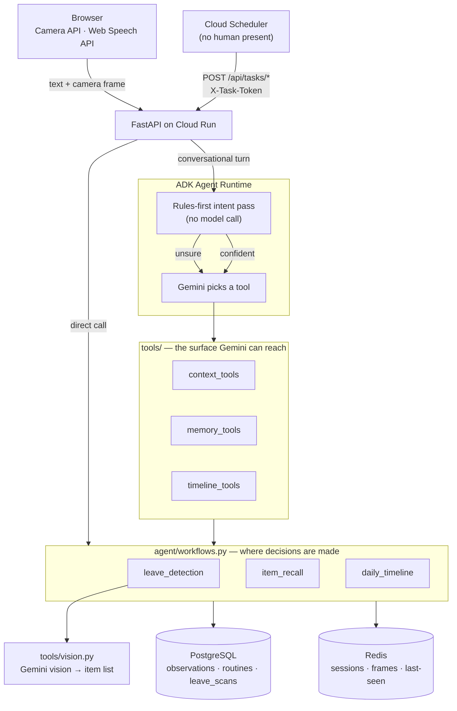

# Architecture

## The one decision everything else follows from

**The agent's memory is an append-only log, not a model's recollection.**

Every fact the agent states — what's missing, when something was last seen, what
you did at 2pm — is computed from rows in `observations`. Gemini phrases the
answer. It never sources it.

This is what makes the failure mode survivable. An agent that improvises "your
AirPods are probably in the kitchen" is worse than useless to someone with ADHD:
it sends them to the wrong room with false confidence. So the workflows are
deterministic functions over the log, and the model's job is language.

---

## The diagram


Source: [`architecture.mmd`](architecture.mmd). Regenerate with:

```bash
npx -y @mermaid-js/mermaid-cli -i docs/architecture.mmd -o docs/images/architecture.png -b white -w 1500 --scale 2
```

Two entry points is the point of the picture: the left-hand one is a person, the
right-hand one is nobody at all. Both run the same workflows against the same
log.

---

## Request flow



**Tools are the surface; workflows are the substance.** A tool never decides
what is missing — it calls a workflow that computes it. That boundary is why the
agent cannot hallucinate a sighting: there is no code path where a model's
opinion becomes a stored fact.

---

## State: what lives where, and why

| | PostgreSQL | Redis |
|---|---|---|
| **Holds** | observations, routines, leave scans, **ADK conversation sessions** | session state, camera frames, last-seen index |
| **Lifetime** | forever, append-only | TTL (24h sessions, 15min frames) |
| **Loss is** | unacceptable | fine |
| **Read by** | every workflow | the hot path, to avoid a round trip |

The split is by *durability requirement*, not by data type. Anything the agent
must be able to answer for tomorrow goes in the log. Anything that is only useful
for the next few minutes — which camera frame is current, who is mid-conversation
— goes in the cache, which is explicitly allowed to be lossy.

Both have in-process fallbacks (`MemoryStore`, `MemoryBackend`), so the service
boots with neither configured. `/healthz` reports `degraded` when that happens,
because a service that silently discards every observation while looking healthy
is the worst possible outcome.

### The observations table

```sql
observations (
  id, user_id,
  observation_type   -- 'item' | 'location' | 'activity'
  subject            -- normalised name: 'airpods', 'office', 'lunch'
  content    JSONB   -- full detail
  observed_at        -- when it happened (UTC; displayed in TIMEZONE)
  location_label, lat, lon,
  location   POINT   -- generated from lat/lon, for future geo queries
  confidence REAL,
  verification_method -- 'visual' | 'voice' | 'manual' | 'inferred'
  session_id
)
```

`subject` is a normalised column rather than a JSONB lookup because recall is the
hottest query and it wants an index scan, not a blob scan. `normalize_subject`
strips possessives and articles so "my AirPods", "AirPods?" and "airpods" all
land on the same key.

---

## Confidence scoring

A sighting's trustworthiness erodes three ways:

```python
confidence × method_weight × exp(-ln2 × age_hours / half_life)
```

- **method_weight** — `visual` 1.0 (the camera saw it) > `voice` 0.85 (you said
  so) > `manual` 0.8 > `inferred` 0.55 (we guessed).
- **half-life** — `RECALL_STALE_AFTER_HOURS`, default 6. After six hours a
  sighting is worth half what it was.

The label drives the phrasing, and the phrasing is the point:

| score | label | what the agent says |
|---|---|---|
| ≥ 0.7 | high | "it should still be there" |
| 0.4–0.7 | medium | "but that was a while ago, so I'd double-check" |
| > 0 | low | "that's old enough that I wouldn't rely on it" |
| 0 | none | "I have no record" |

---

## Learning a routine

`_refine_routine` runs after every leave scan. Over the last 8 scans for a
destination, any item carried on ≥60% of them gets promoted into
`expected_items`.

So the agent starts from a sensible guess (`STARTER_ROUTINES`), and converges on
what you actually carry — including things you never told it about. Take a water
bottle to the gym three times and it starts noticing when you don't.

---

## Autonomy

Two Cloud Scheduler jobs, both hitting endpoints with no user in the loop:

- **`/api/tasks/morning-brief`** — weekdays 08:00. Walks the work routine, runs
  a recall on each item, and reports anything it cannot currently vouch for.
- **`/api/tasks/evening-recap`** — daily 21:00. Reconstructs the day.

These share the same workflows and write to the same log as the conversational
path. The agent's memory is identical whether a human or a cron trigger caused it
to act — which is the actual test of whether the autonomy is real or a demo prop.

---

## Failure handling

| Failure | Behaviour |
|---|---|
| Gemini over quota (429) | HTTP 429 + `Retry-After`; if a tool already ran and persisted, its result is returned rather than discarded |
| Vision call fails | scan returns `available: false` with a reason; the agent says it cannot check instead of guessing |
| Timeline narration fails | falls back to a deterministic list of the day's events |
| Intent classification fails | falls back to the rules result |
| Postgres/Redis unset | in-memory fallback; `/healthz` reports `degraded` |
| Session store unreachable | falls back to in-memory sessions; logs the backend it settled on |
| No Gemini credentials | rules-based routing straight to workflows; `degraded: true` on the reply |

The pattern throughout: **degrade to something honest, never to something
confident.**
